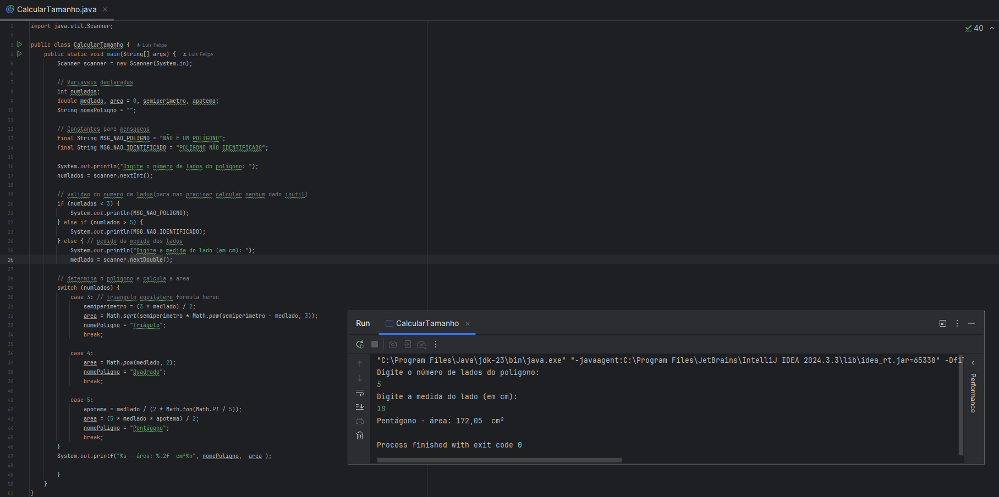

<h1 align="center"> heron-shapes-validator  </h1>

  <a href="#-tecnologias">Tecnologias</a>&nbsp;&nbsp;&nbsp;|&nbsp;&nbsp;&nbsp;
  <a href="#-projeto">Projeto</a>
  

  

 

## 🚀 Tecnologias

Esse projeto foi desenvolvido com as seguintes tecnologias:

- JAVA
- Git e Github

## 💻 Projeto

Projeto desenvolvido em Java que utiliza 
a fórmula de Heron para verificar se três valores 
fornecidos podem formar um triângulo. Além disso,
identifica automaticamente outros formatos geométricos
(como quadrado ou retângulo), garantindo precisão nos cálculos
e validações matemáticas.

---
